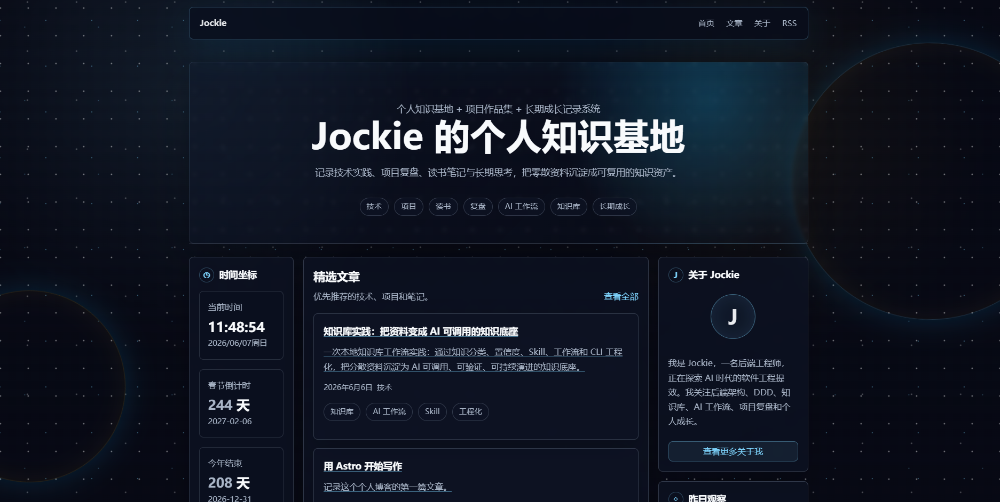
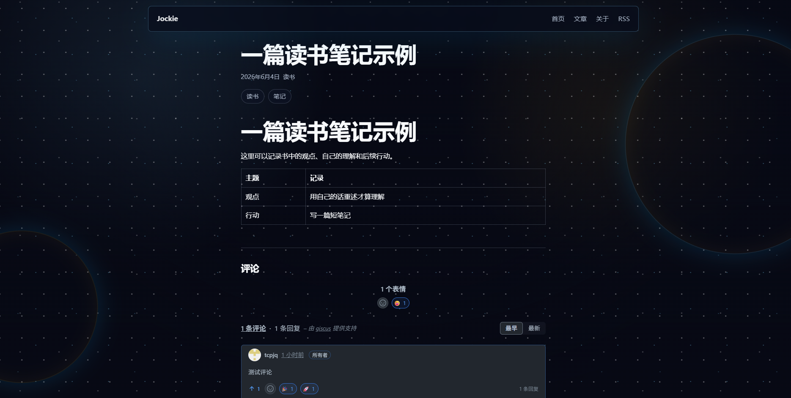

这篇文章主要是提供一个思路，记录我如何准备基础工具来探索 AI。当前这一篇主要是 AI 编程探索：如何让 AI 参与真实项目，并最终做出一个可以访问的小作品。过程中遇到问题，不一定要自己硬查硬试，直接问 AI 往往是更高效的解决方案。

以前用 AI，更多是问问题、写文档、分析方案、解释概念。确实有用，但总感觉还停留在“聊天”和“辅助思考”的层面。

至少要找一个真实场景，让它参与进来，看看它到底能帮我完成到什么程度。所以这两天，我给自己定了一个很小的目标：

**让 AI 帮我搭建一个可以访问的个人博客。**

这次实践比较有意思的一点是：**全程零代码编写。**

我没有自己从头写页面、写样式、写部署配置，而是通过自然语言描述需求，让 AI 参与项目创建、代码生成、问题排查、部署调整和后续优化。人的角色更像是提出目标、判断结果、继续追问和推动过程。

这篇文章不是详细教程，而是分享一个思路：先准备工具，再跑通一个小闭环，让 AI 真正参与项目。

***

## 一、入门思路

简单来说，我的工具组合是：

- **云服务器**：提供稳定的远程环境，可以考虑腾讯云的境外服务器
- **GPT / Codex 等 AI 工具**：让 AI 参与编码、排障和优化
- **Superpowers 开源工作流**：帮助理解需求、拆解规格文档，并引导 AI 编码
- **VS Code Remote SSH**：在本地查看和修改服务器代码
- **GitHub**：管理代码和版本
- **GitHub Pages**：部署博客，让页面可以访问

这里还有一个准备：AI 工具需要账号和额度。比如 GPT 订阅如果遇到支付不方便的情况，iOS 可以考虑通过某宝购买礼品卡，再在 App Store 里兑换使用。

实践路径也很简单：

> 购买腾讯云服务器 -> 在服务器上安装 Codex 并登录账号 -> 引入 Superpowers 工作流 -> 创建 GitHub 仓库 -> Windows 本地通过 VS Code 连接服务器 -> 用自然语言让 AI 生成个人博客 -> 推送到 GitHub -> GitHub Pages 自动构建上线。

这套东西不复杂，但组合起来之后，就能形成一个很朴素的 AI 编程闭环：

> 自然语言描述需求 -> AI 生成和修改代码 -> 本地查看效果 -> 继续让 AI 调整 -> 推送 GitHub -> 自动部署上线

对入门来说，先跑通这个闭环，比一开始追求复杂架构更重要。

***

## 二、为什么要先搭这些工具？

一开始我也想过，直接问 AI：

> “帮我写一个个人博客。”

它当然可以写。

但很快就会遇到一些更现实的问题：

代码放在哪里？在哪里运行？怎么查看页面效果？怎么继续修改？怎么推送到 GitHub？怎么部署成一个能访问的网站？如果 AI 工具跑在服务器上，本地电脑怎么查看和编辑代码？

这些问题不解决，AI 编程很容易停留在“生成代码片段”的阶段。

所以我这次没有先追求博客多好看、功能多完整，而是先把基础工具搭起来。

我的标准很简单：

**能让 AI 写代码，能让我看代码，能把项目跑起来，最后能部署出去。**

更准确地说，这次不是我在写代码，而是我在用自然语言指挥 AI 写代码。我负责描述目标、判断结果、继续追问；Superpowers 负责帮助我理解需求、拆解规格文档，把模糊想法整理成 AI 更容易执行的任务；Codex 则负责生成代码、修改结构、解释报错和完成调整。

只要这个链路跑通，后面再做别的小项目，就不用每次都从零开始。

## 三、踩坑与小优化

这次实践不复杂，但中间也踩了一些很真实的小坑。

- **登录回调问题**：远程服务器登录 Codex 时，需要处理回调地址。我是在本地电脑配合完成授权后解决的。
- **本地访问服务器网页**：服务器启动网页服务后，本地浏览器不一定能直接访问，需要通过 SSH 做端口映射。
- **VS Code 连接频繁输入密码**：一开始每次连接服务器都要输密码，后来配置 SSH Key 后，体验顺滑很多。
- **Codex 粘贴图片不方便**：因为 Codex 跑在服务器上，不能像本地应用一样直接粘贴图片，可以通过 VS Code 中转图片路径。
- **AI 工具额度有限**：AI 编程会经历多轮生成、修改、调试和部署，额度消耗比普通问答更明显，需要提前有心理预期。
- **订阅支付问题**：如果正常支付不方便，可以尝试通过淘宝购买礼品卡，再兑换到 App Store 里完成订阅。
- **遇到问题直接问 AI**：比如端口映射、部署报错、连接失败、命令报错，都可以直接在 Codex 里提问，让 AI 帮忙分析和给方案。

这些坑都不算复杂，但足够说明一件事：

**AI 编程入门，真正重要的不只是某个工具，而是把工具之间的连接关系理顺。**

## 四、实践成果

最终，我用这套工具跑通了一个完整小闭环：

- AI 帮我生成和修改博客代码
- 本地 VS Code 查看和调整
- 推送到 GitHub
- GitHub Pages 自动部署
- 博客可以真实访问，评论功能也能继续接入

博客本身很基础，但它证明了一件事：

**AI 不只是能回答问题，也能参与真实项目，从创建到上线。**

而且这次过程基本是零代码编程：我更多是在用自然语言描述目标、提出修改意见、让 AI 排查问题和完成调整。

## 五、经验总结

**AI 探索不能只停留在看教程和聊天，最好尽快找一个小项目跑起来。**

项目不需要大，个人博客就足够；关键是让 AI 真实参与一次从开发到上线的过程。

AI 的能力很强，但它不会自动变成我的能力。只有我真的去使用它、指挥它、验证它，并把它放进一个个真实项目里，它才会慢慢变成我自己的生产力。先动手，先跑通，先做出一个属于自己的小成果。
